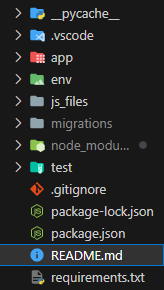
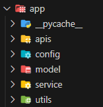

# Conversion Container API Server
---

# 프로젝트 개요
  **Tag Manager**라는 서비스는 다양한 마케팅 툴과 애널리틱스 플랫폼 등의 태그들을 한 곳에서 관리하고 적용할 수 있도록 도와주는 솔루션이다. 대표적인 솔루션으로는 Google Tag Manager(GTM)이 있지만 클라이언트 여건상 이를 사용하지 못하는 경우가 있다. 그렇기 때문에 독자적으로 사용할 수 있는 태그 관리 솔루션이 필요한 상황이다.

현재 상황에서는 Google Analytics, Meta Pixel, Kakao Moment 등의 마케팅 툴에서 제공하는 **전환 스크립트**를 편하게 관리해야 하는 것이 목적이기 때문에 이 프로젝트를 통해 하나의 애플리케이션에서 여러 종류의 전환 스크립트를 다룰 수 있는 것을 목표로 한다.

```
해당 프로젝트는 이러한 시스템의 **API 서버** 기능을 수행한다.
```


#
# 시스템 메인 User Case(로그인 상태로 가정)
### 컨테이너 추가

> **컨테이너**
>
> 도메인 단위로 실제 전환 스크립트가 발생할 조건인 **이벤트**와 해당 사이트에서 사용할 **매체**(마케팅 툴), 실제 전환 스크립트 코드 등이 담기는 틀

1. 컨테이너 추가 클릭
2. 해당 컨테이너가 적용될 도메인, 컨테이너에 대한 설명 입력 후 추가 요청

## 매체 추가
> **매체(Medium)**
>
> GA, Meta pixel 등의 매체 정보를 저장한다. 각 매체에서는 프로젝트 생성 시 사이트 html파일에 \<head\> 태그에 추가해야 하는 공통 유틸리티 스크립트와 트래킹 id를 제공하는데 이를 저장한다. 이들이 웹페이지에 추가되어야 전환 스크립트 코드 동작 시 리포팅이 이루어진다.
1. 컨테이너를 선택해 설정 페이지로 진입
2. 현재 시스템에서 사용가능한 매체 리스트 중 하나를 선택한다.
3. 해당 매체에서 제공하는 공통 유틸리티 스크립트와 트래킹 id를 입력한다.

## 이벤트 추가
> **이벤트(Event)**
>
> 웹 페이지에서 일어나는 이벤트(클릭, 페이지 이동, 스크롤 등)에 대한 이벤트 리스너 코드가 담겨있다. 시스템 내부에서 실제 전환 스크립트를 실행하는 $trigger라는 함수가 정의되는데 이것이 콜백 함수로 담겨야 한다. 또한 특정 url에서만 실행되도록 url 정규식 정보도 저장한다.
1. 컨테이너를 선택해 설정 페이지로 진입
2. 이벤트 리스너 코드와, url 정규식을 입력한다.

## 태그 추가
> **태그(tag)**
>
> 실제 전환 스크립트에 대한 내용이 담긴다. 일반적으로는 매체에서 제공하는 메서드(GA: gtag(), meta pixel: fbq())가 담긴다. 그러므로 한 태그는 특정 메체와 이벤트에 연결되어 있다. 한 dom 이벤트에서 한 매체에서 제공하는 전환 보고 함수가 담기는 모양이다.
1. 컨테이너를 선택해 설정 페이지로 진입
2. 생성되어 있는 매체와 이벤트를 선택
3. 해당 이벤트가 발생했을 때 실행될 매체의 전환 스크립트 코드 입력

## 사이트에 컨테이너 적용
1. 컨테이너 페이지에서 '공통 스크립트 받기' 요청
2. 공통 스크립트 제공
3. 해당 스크립트를 사이트 \<head\> 태그에 삽입


#
# 주요 시스템 동작과정
## 배포 과정
1. 컨테이너 페이지에서 배포 요청
2. 서버에서 medium, event, tag에 대한 데이터를 db에서 가져와 각각의 js 파일(medium.js, event.js, tag.js)에 object 타입으로 저장하고 export 한다.
3. 미리 만들어져 있는 index.js 파일에서는 위의 파일들에 정의된 변수들을 import 한 후 이들을 이용해 실제로 매체별 공통 유틸리티 스크립트, Event의 이벤트 리스너, 이벤트 리스너의 콜백으로 실행될 실제 전환 스크립트를 추가하고 실제로 매체에 리포팅이 가능하게끔 코드가 구성되어 있다.
4. webpack을 이용해 index.js를 entry로 하여 하나의 독립된 js 파일인 script.js로 번들링한다.
5. 해당 파일을 s3에 업로드

## 공통 스크립트 동작 과정
1. 사용자가 사이트에 접속
2. \<head\>에 삽입된 공통 스크립트가 동작하여 API server에 스크립트 추가 요청
3. 서버에서 현제 사이트 도메인에 해당하는 script 파일이 저장된 s3 경로를 찾은 뒤 이것을 담아 응답
4. 이것을 받아 \<script\> 태그의 source 속성을 s3 경로로 설정한 뒤 해당 태그를 추가
5. 추가한 \<script\> 태그가 동작하면서 각 매체의 공통 유틸리티 스크립트를 다운로드하고 이벤트 리스너와 콜백에서 실행될 전환 스크립트들이 세팅됨


# 프로젝트의 구조

- app: 해당 애플리케이션에 동작하기 위한 코드들이 담긴 패키지
- js_files: 컨테이너 배포 시 필요하거나 생성되는 js 파일들이 담기는 폴더
- test: 테스트 코드들이 담긴 패키지

# 'app/'의 패키지 구조

## app/__init__.py
- flask 애플리케이션을 생성
- jwt, db, oauth와 관련된 라이브러리를 해당 애플리케이션과 연결
- restx에서 사용되는 namespace를 등록
## apis
rest api 요청을 처리하는, 즉 요청에 대한 실제 비즈니스 로직을 처리하고 응답하는 코드들로 이루어진 패키지이다.
- `auth_api.py`: 회원가입/로그인 관련 api
- `container_api.py`: Container 엔티티에 대한 api
- `event_api.py`: Event 엔티티에 대한 api
- `medium_api.py`: Medium 엔티티에 대한 api
- `script_api.py`: Script 엔티티에 대한 api
- `tag_api.py`: Tag 엔티티에 대한 api

## config
설정 파일들이 위치하는 폴더
- `container_config.py`: 스크립트가 저장되는 s3에 대한 설정 정보가 포함되어 있다.
- `flask_config.py`: secret key, oauth 클라이언트, db 연결 등의 정보가 포함되어 있다. Config라는 클래스를 상속하여 개발환경에 따라 설정 정보를 구성할 수 있다.

## model
해당 프로젝트에서는 직접적인 sql 쿼리가 아닌, sqlalchemy이라는 orm을 사용한다. 그렇기 때문에 해당 패키지에서는 각 테이블에 대응하는 엔티티 클래스들이 포함된다.
- `container_auth.py`: 이후 추가될 회원마다 컨테이너에 대해 가지는 권한 기능과 관련된 엔티티 클래스들이 포함되어 있다. 회원과 컨테이너를 n:m으로 연결하기 위한 중간엔티티인 `UserContainer`과 권한의 종류가 담겨있는 엔티티인 `Authorizaion`을 n:m으로 연결하기 위한 `ContainerAuthorization` 엔티티가 있다.
- `container.py`: Container에 대응하는 `Container` 엔티티 클래스가 있다.
- `event.py`: Event에 대응하는 `Event` 엔티티 클래스가 있다.
- `medium.py`: 현재 서비스에서 사용가능한 플랫폼(GA, meta pixel 등의 분석도구)에 대한 정보가 담기는 `PlatformList` 엔티티 클래스와 Medium에 대응하는 `Medium` 엔티티 클래스가 있다.
- `oauth_service.py`: 현재 서비스에서 소셜로그인이 가능한 플랫폼(google, kakao 등)에 대한 정보가 담기는 **OauthServic`* 엔티티 클래스가 있다.
- `script.py`: 현재 컨테이너의 event, medium, tag 정보를 통해 전환 스크립트 실행 기능을 하는 js 파일에 대한 정보가 담기는 `Script` 엔티티 클래스가 있다.
- `tag.py`: Tag에 대응하는 `Tag` 엔티티 클래스가 있다.
- `user.py`: 회원에 대응하는 `User` 엔티티 클래스가 있다.

## utils
  `apis/`에서 처리하기에 복잡한 로직들을 추상화하기 위한 패키지
- `auth_util.py`: 권한과 관련한 작업을 수행할 때 필요
- `container_util.py`: 컨테이너와 관련한 작업을 수행할 때 필요
- `s3_util.py`: aws s3 서비스를 사용할 때 필요
- `script_util.py`: `js_files/`에 있는 js 파일들을 번들링 할 때 필요


## 보안관련 사항
`app/config/`의 파일들은 따로 보관하고 있으니 필요 시 **joe.jeong@cheilpengtai.com**으로 문의